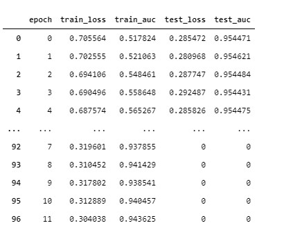

# BERT wiki训练(training)与情感分析

两部分
- 基于中文wiki的BERT训练
- 情感的正面与负面分析

## Dependencies

- Python 3
- Computing power (high-end GPU) and memory space (both RAM/GPU's RAM) is **extremely important** if you'd like to train your own model. （基于3070训练wiki语料库3天时间）


## Instructions


### Step 0. 生成字典与构建dataset
- 字典生成对应的位置在 [`corpus/wiki_preprocessing`](corpus/wiki_preprocessing)
- 构建dataset位置 [`dataset/`](dataset/)

dataset 三部分：
- 1. wiki dataset 字符的MASK,句子的is_next. 对应的CLS和SEP
- 2. sentiment 训练的dataset 对应的CLS和SEP
- 3. any sentence 应用的dataset 对应的CLS和SEP


### Step 1. 模型设计
*本体基于huggingface/transformers里面pytorch BERT的实现*

sentiment analysis 结构使用CLS取最后一层hidden_layer的向量（也可以取别的层），接一个全连接
```
self.bert = BertModel(config)
self.dense = nn.Linear(config.hidden_size,1)
self.activation = nn.Sigmoid()
```

如果需要训练wiki BERT
```
# run 对应的config 在config文件夹中

python BERT_training.py 
```

sentiment training
```
python sentiment_training.py 
```


### Step 2. 情感分析 & 评价

```
# 可以自己添加任意文字在text中
python baseline.py

```

# sentiment 训练结果
<p align="center">
  
</p>

96个epoch 我就停了，训练差不多2个小时吧。如果想继续提升的话，还可以继续训练下去。